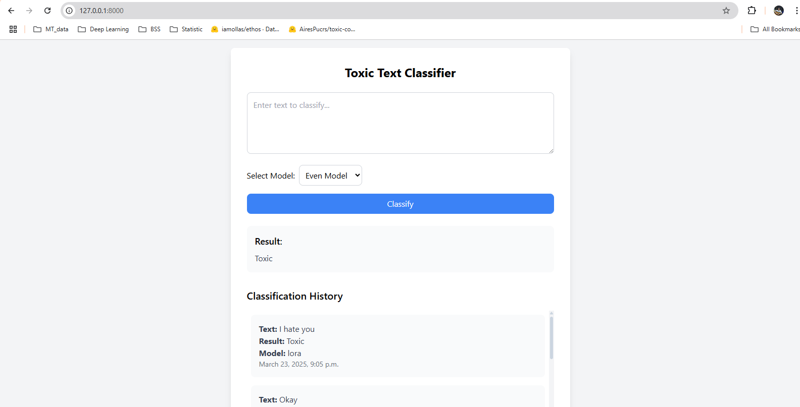

# NLP-A7-st124973

# Toxic Text Classifier

A web application built with Django that classifies whether a given text input is toxic or non-toxic. Users can select between three models (Even, Odd, and LoRA) for classification. The application also displays a scrollable history of past classifications.

## Features

- **Text Classification**: Classifies input text as "Toxic" or "Non-Toxic" using pre-trained models.
- **Model Selection**: Choose between three models:
  - Even Model
  - Odd Model
  - LoRA Model
- **Classification History**: Displays a scrollable history of all classified texts, their results, and the model used.
- **Beautiful UI**: Designed with Tailwind CSS for a clean and responsive user interface.

## Technologies Used

### Backend:
- Django (Python web framework)
- Hugging Face Transformers (for pre-trained models)
- PyTorch (for model inference)

### Frontend:
- HTML, CSS (Tailwind CSS)

### Database:
- SQLite (default Django database)

## Setup Instructions

### Prerequisites
- Python 3.8 or higher
- pip (Python package manager)

### Step 1: Clone the Repository
```bash
git clone https://github.com/FrancisPhone/NLP-A7-st124973.git
cd app/
```

### Step 2: Create a Virtual Environment
```bash
python -m venv venv
source venv/bin/activate  # On Windows: venv\Scripts\activate
```

### Step 3: Install Dependencies
```bash
pip install -r requirements.txt
```

### Step 4: Set Up the Database
Run the following commands to create and apply migrations:
```bash
cd ToxicTextClassifier/
python manage.py makemigrations
python manage.py migrate
```

### Step 5: Run the Development Server
```bash
python manage.py runserver
```

### Step 6: Access the Application
Open your browser and go to [http://127.0.0.1:8000/](http://127.0.0.1:8000/).

## Usage
1. **Enter Text**: Type or paste your text into the input box.
2. **Select Model**: Choose a model from the dropdown (Even, Odd, or LoRA).
3. **Classify**: Click the "Classify" button to see the result.
4. **View History**: The classification history is displayed below the input box. It is scrollable if the list becomes too long.

## Evaluation Results and Model Comparison

The models were evaluated on the AiresPucrs/toxic-comments dataset. Below is a comparison of the three models based on their evaluation metrics:

| Model                          | Accuracy | Precision | Recall | F1 Score |
|--------------------------------|----------|------------|---------|----------|
| Even Layers Student Model      | 0.9856   | 0.9855     | 0.9859  | 0.9857   |
| Odd Layers Student Model       | 0.9861   | 0.9863     | 0.9863  | 0.9863   |
| BERT-based-uncased with LoRA   | 0.9536   | 0.9575     | 0.9503  | 0.9539   |

## Challenges and Proposed Improvements

### Challenges Encountered

#### **Distillation Fine-Tuning (Odd and Even Layer Models)**
- **Challenge**: The distillation process was computationally expensive and time-consuming. Performance was highly dependent on the teacher model and distillation strategy.
- **Improvement**:
  - Explore efficient distillation techniques (e.g., layer-wise or attention-based distillation) to reduce computational overhead while maintaining performance.

#### **LoRA Fine-Tuning**
- **Challenge**: While LoRA fine-tuning is parameter-efficient, it underperformed compared to the distillation-based models in accuracy and F1 score.
- **Improvement**:
  - Increase the Rank: Experiment with higher ranks for the low-rank matrices to capture more task-specific information.
  - Task-Specific Adaptation: Fine-tune LoRA on a larger and more diverse dataset to improve generalization.
  - Hybrid Approaches: Combine LoRA with distillation techniques to leverage strengths from both methods.

## Project Structure
```
app/
├── classifier/
│   ├── migrations/          # Database migrations
│   ├── templates/           # HTML templates
│   │      └── home.html     # Main template
│   ├── __init__.py
│   ├── admin.py             # Django admin configuration
│   ├── apps.py              # App configuration
│   ├── models.py            # Database models (e.g., History)
│   ├── tests.py             # Unit tests
│   ├── urls.py              # URL routing
│   ├── utils.py             # Utility functions
│   └── views.py             # View logic
├── app/
│   ├── __init__.py
│   ├── asgi.py              # ASGI configuration
│   ├── settings.py          # Django settings
│   ├── urls.py              # Project URL routing
│   └── wsgi.py              # WSGI configuration
├── db.sqlite3               # SQLite database
├── manage.py                # Django management script
└── requirements.txt         # Project dependencies
```

## Acknowledgments
- **Hugging Face Transformers** for pre-trained models.
- **Tailwind CSS** for UI styling.
- **Django** for the web framework.
- **AiresPucrs/toxic-comments** for the dataset used in this project.

## Contact
For questions or feedback, please contact:

- **Name**: Phone Myint Naing  
- **Email**: [francisphone1998@gmail.com](mailto:francisphone1998@gmail.com)  
- **GitHub**: [Francis Phone](https://github.com/FrancisPhone/)  

## Demo
